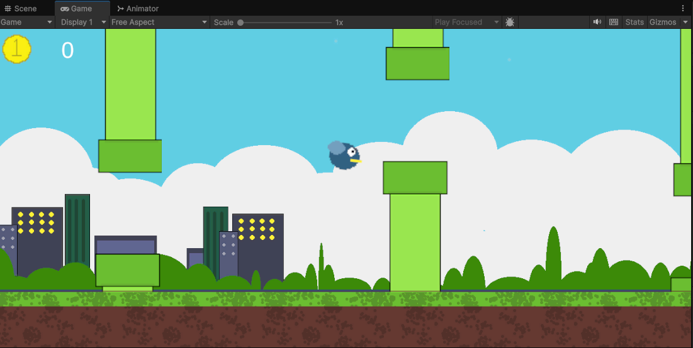

# Flappy Bird

> Flappy Bird — мобильная игра, разработанная вьетнамским художником и программистом видеоигр Донгом Нгуеном. Игра представляет собой сайд-скроллер
, в котором игрок управляет птицей, пытаясь пролететь между колоннами зеленых труб, не задевая их.

Темы: 
- сайд-скроллер
- бесконечная генерация
- параллакс
Версия: Unity 6000.0.36f1 (LTS)
